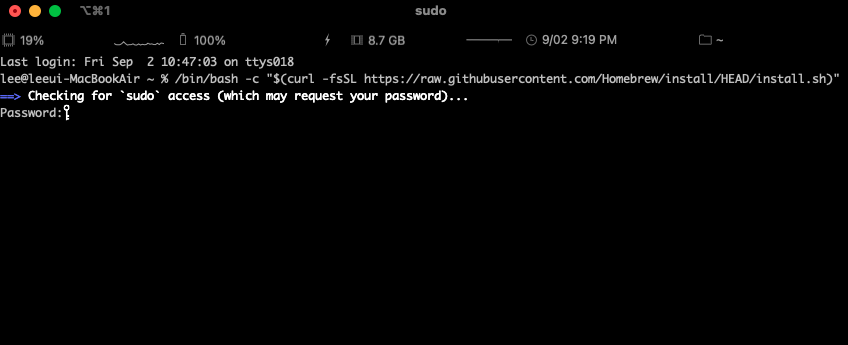
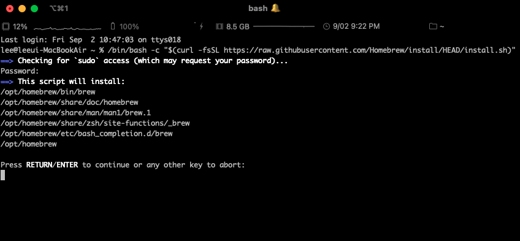
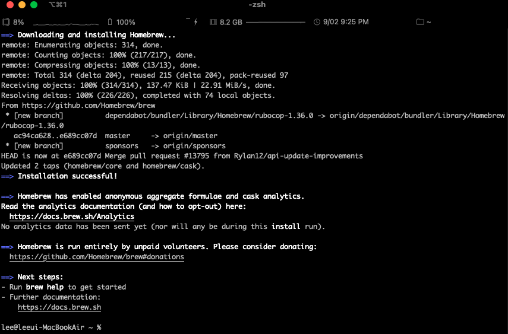

## 1.Homebrew 명령어
- `brew ~`: 커맨드 라인 프로그램
- `brew update`: 홈브류 최신버전 업데이트
- `brew install <패키지명>[@버전]`: 프로그램 설치(최신버전으로)
  - ex) brew install mysql, brew install mysql@5.5
- `brew outdated`: 업그레이드 필요한 프로그램 찾기
- `brew upgrade <패키지명>`: 패키지 업그레이드
- `brew upgrade` : 모든 패키지 업그레이드
- `brew cleanup <패키지명>` : 버전을 여러개 깔았는데 최신버전 이외의 버전들 전부 삭제
- `brew uninstall <패키지명>` : 특정 패키지 삭제

## 2.Homebrew 설치 방법


먼저 **터미널**을 실행시켜 주세요. 그 다음 [홈브류 사이트](https://brew.sh/index_ko) 으로 들어간 후 설치하기를 복사하고 붙여넣기를 해주세요.


**Password**를 입력하라고 나옵니다.

그러면 자신의 Mac 로그인에 사용되는 비밀번호를 작성 후 **return** 키를 눌러주세요.



사진처럼 진행되고 마지막 문장 **Press RETURN to continue or any other key to abort**가 나오면

**return** 키를 눌러주세요.



사진과 같은 화면이 나오면 정상적으로 **Homebrew** 설치가 완료된 거예요.


```toc

```