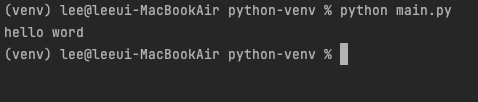

테스트를 하기 앞서 저는 이전 [파이썬 가상환경 만들기](https://codingpalette.com/python-venv/) 에서 코드를 작성하도록 하겠습니다.

`source venv/bin/activate` 으로 가상환경을 실행시켜 주시고 `main.py`라는 파일을 생성합니다.

생성이 완료 되었으면
```python
print('hello word') 
```
라고 입력한 뒤 터미널에서 `python main.py` 라고 입력하시고 아래 이미지 처럼 나오시면 정상적으로 준비가 완료 된 것 입니다.



아래 코드들을 입력하시고 확인하고 싶으시면 `python main.py` 라고 입력하시면 됩니다.

## 1.주석 및 프린트

### 1-1.주석
주석처리는 `#` 으로 하면 주석이 됩니다.
```python
# 이것은 주석 입니다.
```

### 1-2.프린트
프린트 출력은 `print()`으로 출력이 가능합니다.
```python
print('텍스트 출력')
# Output:
# 텍스트 출력 
```

## 2.변수

### 2-1.변수 할당
**cat_name**이라는 변수에 나비라는 문자열을 할당해 보겠습니다.
```python
cat_name = "나비"
print(cat_name)
# Output:
# 나비
```

### 2-2.숫자 계산
변수에 숫자를 담아 사칙연산을 해보도록 하겠습니다.
```python
a = 20
b = 10
print(a + b)
# Output:
# 30
```

### 2-3.변수 + 텍스트 출력
변수와 텍스트를 합칠때는 앞에 `f' 입력 '`(한줄일 때) 또는 `f''' 입력 ''''`(여러줄일 때)를 활용하면 됩니다.

```python
cat = '고양이'
name = '나비'
cat_name = f'{cat} 이름은 {name} 입니다.'
print(cat_name)
# Output:
# 고양이 이름은 나비 입니다.
```

## 3.연산자

### 3-1.산술 연산자
a = 10, b = 20, c = 3 이라고 하면

| Operator | Description |    Example    |
|:--------:|:-----------:|:-------------:|
|    +     |     더하기     |  a + b = 30   |
|    -     |     빼기      |  a - b = -10  |
|    *     |     곱하기     |  a * c = 30   |
|    /     |     나누기     |  b / a = 2.0  |
|    %     |     나머지     |   b % a = 0   |
|    **    |     제곱      | a ** c = 1000 |
|    //    |      몫      |  a // c = 0   |

### 3-2.비교 연산자

a = 10, b = 20 이라고 하면

| Operator | Description            | Example          |
|:--------:|------------------------|------------------|
|    ==    | 값이 동일하다                | (a == b) → false |
|    !=    | 값이 동일하지 않다             | (a != b) → true  |
|    >     | 왼쪽 값이 오른쪽 값보다 크다       | (a > b) → false  |
|    <     | 왼쪽 값이 오른쪽 값보다 작다       | (a < b) → true   |
|    >=    | 왼쪽 값이 오른쪽 값보다 크거나 동일하다 | (a >= b) → false |
|    <=    | 왼쪽 값이 오른쪽 값보다 작거나 동일하다 | (a <= b) → true  |

### 3-3.할당 연산자
a = 10, b = 20, d = 3 이라고 하면

| Operator |             Description             |       Example       |
|:--------:|:-----------------------------------:|:-------------------:|
|    =     |         왼쪽 변수에 오른쪽 값을 할당한다          | c = a + b -> c = 30 |
|    +=    |   왼쪽 변수에 오른쪽 값을 더하고 결과를 왼쪽 변수에 할당   |  b += a -> b = 30   |
|    -=    |   왼쪽 변수에서 오른쪽 값을 빼고 결과를 왼쪽 변수에 할당   |  b -= a -> b = 10   |
|    *=    |   왼쪽 변수에 오른쪽 값을 곱하고 결과를 왼쪽 변수에 할당   |    b *= a -> 200    |
|    /=    |  왼쪽 변수에서 오른쪽 값을 나누고 결과를 왼쪽 변수에 할당   |    b /= a -> 2.0    |
|    %=    | 왼쪽 변수에서 오른쪽 값을 나눈 나머지의 결과를 왼쪽변수에 할당 |     b %= a -> 0     |
|   **=    | 왼쪽 변수에 오른쪽 값만큼 제곱을 하고 결과를 왼쪽변수에 할당  |   b **= d -> 8000   |
|   //=    |  왼쪽 변수에서 오른쪽 값을 나눈 몫의 결과를 왼쪽변수에 할당  |    b // = a -> 2    |


### 3-4.논리 연산자
a = True, B = False 이라고 하면

| Operator |       Description       |       Example       |
|:--------:|:-----------------------:|:-------------------:|
|   and    |  논리 AND 연산, 둘다 참일때만 참   |  (a and b) = False  |
|    or    | 논리 OR 연산, 둘중 하나만 참이라도 참 |   (a or b) = True   |
|   not    |  논리 NOT 연산, 논리 상태를 반전   | not(a and b) = True |

### 3-5.맴버 연산자
a = 10, b = 10, list = [1, 2, 3, 4, 5] 이라고 하면

| Operator |     Description      |        Example         |
|:--------:|:--------------------:|:----------------------:|
|    in    |   list 내 포되어 있으면 참   |  (a in list) = False   |
|  not in  | list 내 포함되어 있지 않으면 참 | (b not in list) = True |


## 4.조건문

### 4-1.if
특정 값이 참일 때 출력하도록 해보겠습니다.
```python
number = 10
if number == 10:
    print('숫자는 10입니다.')
# Output:
# 숫자는 10입니다.
```
위 코드는 number 라는 변수에 10이라는 숫자가 들어가 있고 조건문에서 number는 10이라는 숫자와 동일하기 때문에 참이고 안쪽에 프린트가 출력 될 수가 있습니다.

### 4-2.else
여기서 특정 값이 아니라고 하면 아래처럼 하면 됩니다.
```python
number = 11
if number == 10:
    print('숫자는 10입니다.')
else:
    print('숫자는 10이 아닙니다.')
# Output:
# 숫자는 10이 아닙니다.
```

### 4-3.elif
조건을 여러 개 주는 것도 가능합니다.
```python
number = 12
if number == 10:
    print("숫자는 10입니다.")
elif number == 12:
    print("숫자는 12입니다.")
else:
    print("숫자는 10도 12도 아닙니다.")
# Output:
# 숫자는 12입니다.
```

### 4-4.삼항연산자
조건문을 한줄로 쓰고 싶을때는 삼항연산자를 이용하면 됩니다.
```python
number = 10
print("숫자는 10입니다." if number == 10 else "숫자는 10이 아닙니다.")
# Output:
# 숫자는 10입니다.
```

## 5.리스트

리스트는 여러 요소들을 갖는 집합(컬렉션)으로 새로운 요소를 추가하거나 갱신, 삭제하는 일이 가능합니다. 

파이썬의 리스트는 동적배열(Dynamic Array)로서 자유롭게 확장할 수 있는 구조를 가지고 있습니다. 

리스트는 그 안의 요소(element)들은 그 값을 자유롭게 변경할 수 있는 Mutable 데이터 타입입니다.

### 5-1.리스트 만들기
리스트를 사용하면 1, 3, 5, 7, 9 숫자 모음을 다음과 같이 간단하게 표현할 수 있습니다.
```python
number_list = [1,2,3,7,9]
```

### 5-2.리스트 값 찾기
몇 번째 리스트에 어떤 값이 있는지 알려면 아래와 같이 해주시면 됩니다.
```python
a = [1,2,3,4]
print('a의 0번째 값은', a[0], '입니다.')
# Output:
# a의 0번째 값은 1 입니다.
```

```python
a = [1,2,3,4]
print('a의 1~2번째 값은', a[0:2], '입니다.')
# Output:
# a의 1~2번째 값은 [1, 2] 입니다.
```

```python
a = [1,2,3,4]
print('a의 뒤에서 2번째 값은', a[-2], '입니다.')
# Output:
# a의 뒤에서 2번째 값은 3 입니다.
```

### 5-3.리스트 연산하기
리스트 더하기
```python
a = [1, 2, 3]
b = [4, 5, 6]
print(a + b)
# Output:
# [1, 2, 3, 4, 5, 6]
```

리스트 반복하기
```python
a = [1, 2, 3]
print(a * 3)
# Output:
# [1, 2, 3, 1, 2, 3, 1, 2, 3]
```

리스트 길이 구하기
```python
a = [1, 2, 3]
print(len(a))
# Output:
# 3
```

특정 개수가 몇개인지 구하기
```python
a = [1, 2, 3, 4, 1]
print(a.count(1))
# Output:
# 2
```

특정 값이 몇번째에 있는지 구하기
```python
a = [1, 2, 3, 4]
print(a.index(3))
# Output:
# 2
```

### 5-4.리스트 추가,수정,삭제
append 로 리스트 추가

append(x)는 리스트의 맨 마지막에 x를 추가하는 함수 입니다.
```python
a = [1, 2, 3]
a.append(4)
print(a)
# Output:
# [1, 2, 3, 4]
```
insert 로 리스트 추가

insert(a, b)는 리스트의 a번째 위치에 b를 삽입하는 함수 입니다.
```python
a = [1, 2, 3]
a.insert(0, 4)
print(a)
# Output:
# [4, 1, 2, 3]
```

리스트 확장하기

extend(x)에서 x에는 리스트만 올 수 있으며 원래의 a 리스트에 x 리스트를 더합니다.
```python
a = [1, 2, 3]
a.extend([4, 5])
print(a)
# Output:
# [1, 2, 3, 4, 5]
```

리스트에서 값 수정하기
```python
a = [1, 2, 3, 4]
a[1] = 7
print(a)
# Output:
# [1, 7, 3, 4]
```

del 함수를 이용하여 삭제하기
```python
a = [1, 2, 3, 4]
del a[1]
print(a)
# Output:
# [1, 3, 4]
```

### 5-5.리스트 정렬, 뒤집기
sort 함수는 리스트의 요소를 순서대로 정렬해 줍니다.
```python
a = [1, 4, 3, 2]
a.sort()
print(a)
# Output:
# [1, 2, 3, 4]
```

reverse 함수는 리스트를 역순으로 뒤집어 줍니다.
```python
a = ['a', 'c', 'b']
a.reverse()
print(a)
# Output:
# ['b', 'c', 'a']
```

## 6.튜플
Tuple은 리스트와 비슷하게 여러 요소들을 갖는 컬렉션 입니다.

리스트와 다른 점은 Tuple은 새로운 요소를 추가하거나 갱신, 삭제하는 일을 할 수 없습니다.

### 6-1.튜플과 리스트의 다름점
- 리스트는 [ ]으로 둘러싸지만 튜플은 ( )으로 둘러싼다.
- 리스트는 그 값의 생성, 삭제, 수정이 가능하지만 튜플은 그 값을 바꿀 수 없다.

### 6-2.튜플 만들기
```python
t1 = ()
t2 = (1,)
t3 = (1, 2, 3)
t4 = 1, 2, 3
t5 = ('a', 'b', ('ab', 'cd'))
```

리스트와 모습은 거의 비슷하지만 튜플에서는 리스트와 다른 2가지 차이점을 찾아볼 수 있습니다.

t2 = (1,)처럼 단지 1개의 요소만을 가질 때는 요소 뒤에 콤마(,)를 반드시 붙여야 한다는 것과 t4 = 1, 2, 3처럼 괄호( )를 생략해도 무방하다는 점입니다.

튜플은 값을 변화시킬 수 없다는 점만 제외하면 리스트와 완전히 동일합니다.


[//]: # (https://wikidocs.net/1162)


```toc

```
