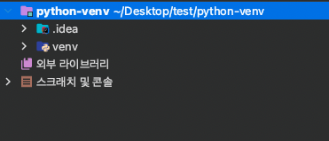
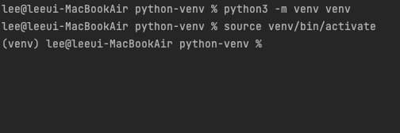
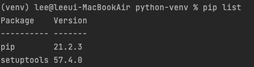
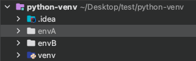
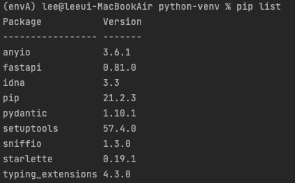

## 1.가상환경 생성

python 3.3 이상의 버전 부터는 venv 모듈을 내장하고 있으므로 따로 설치없이 가능합니다.

터미널을 열어 자신이 개발하려는 workspace 폴더에 가서 아래 명령어를 입력합니다.

`python3 -m venv venv`

venv은 가상환경 이름이므로 자유롭게 쓰면 됩니다.



해당 구문을 실행하면 위 이미지 처럼 venv이름을 가진 가상 환경 폴더가 생성 됩니다.

## 2.가상환경 실행

생성을 했으면 해당 가상환경을 실행해야 합니다.

실행 소스 파일은 가상 환경 폴더 안의 bin폴더 안에 있습니다.

`source venv/bin/activate`

source 명령어를 통해 activate파일을 실행시켜 가상환경에 진입합니다.



위 이미지처럼 terminal 앞쪽에 **(venv)**같이 가상환경의 이름이 붙으면 진입에 성공한 것 입니다.



`pip list` 명령어를 통해 설치된 패키지 버전들을 확인해보면 pip와 setuptools 빼고는 아무것도 설치가 안된 깨끗한 상태임을 확인할 수 있습니다.

python3로 가상환경을 만들고 진입했으면 pip3 대신 `pip` 명령어를 사용해도 됩니다.

## 3.가상환경 종료

가상환경을 종료하려면 deactivate 명령어를 사용하면 됩니다.

`deactivate`

터미널 앞에 가상환경 이름이 사라지면 정상적으로 종료된 것 입니다.

## 4.패키지 관리

pip에선 설치된 패키지를 정리하고 설치하는 방법이 존재합니다. 사용방법은 아래와 같습니다.

envA와 envB 가상환경 2개를 만들어 보겠습니다.

```shell
python3 -m venv envA
python3 -m venv envB
```



그다음 envA에 진입합니다.

`source envA/bin/activate`

이제 **fastapi** 패키지를 설치한 후 확인해 보겠습니다.
```shell
pip install fastapi
pip list
```



위 이미지와 같이 패키지가 정상적으로 설치가 되었고 이제 이 패키지들을 리스트업 해보겠습니다.

`pip freeze > requirements.txt`

해당 명령어를 실행하면 실행한 위치에 requirements.txt가 생성된 것을 확인할 수 있습니다.

(requirements.txt 파일명은 컨벤션이니 되도록 맞추도록 합니다.)

이제 **envA** 가상환경을 종료하고 **envB** 가상환경으로 접속후 리스트를 확인해 보겠습니다.

```shell
deactivate
source envB/bin/activate
pip list
```
그러면 초기패키지 리스트가 뜨는 것을 확인 할 수 있습니다.

다음으로 리스트업한 패키지를 설치해보도록 하겠습니다.

`pip install -r ./requirements.txt`

위 명령어를 실행하면 패키지 설치가 진행이 됩니다. 

설치 완료 후 `pip list`를 입력하면 정상적으로 설치된 패키지 리스트가 출력이 되는 것을 확인 할 수 있습니다.


```toc

```
