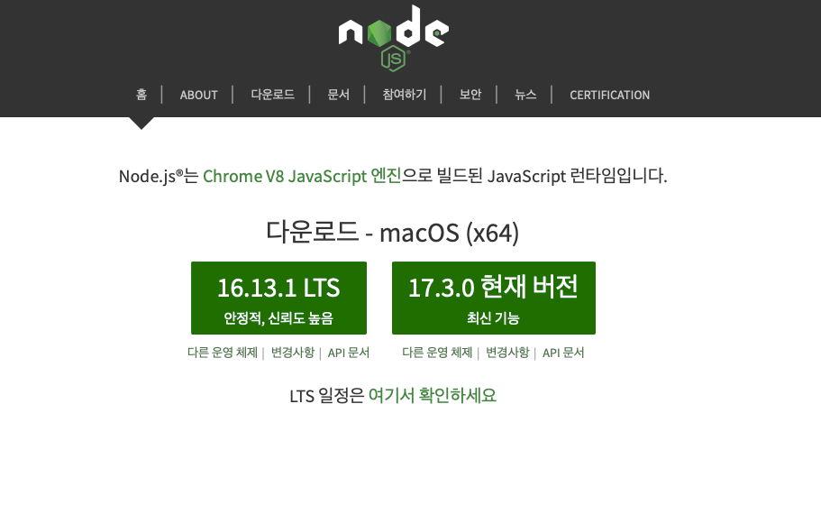
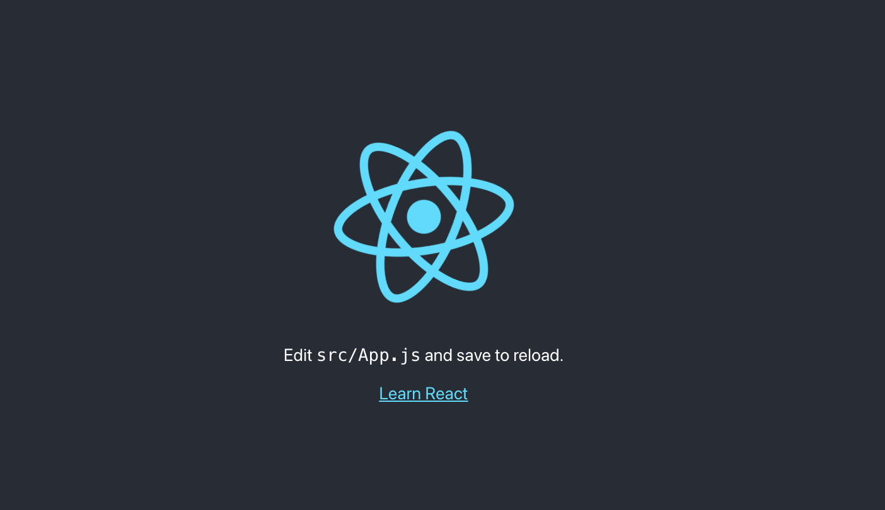

리액트 기본 설치 및 실행 방법에 대해 알아보겠습니다.

## 1.Node.js 설치
리액트 프로젝트를 만들기 위해서는 Node.js와 npm을 반드시 먼저 설치하셔야 합니다.
[node.js 다운로드 홈페이지](https://nodejs.org/ko/) 에서 LTS 버전을 다운로드 및 설치를 진행해 주시면 됩니다.



설치가 완료 되었으면 윈도우 사용자는 cmd 맥 사용자는 터미널을 열어주시고
`node -v` 를 입력해주시면 `v16.13.0` 이라는 버전이 뜨면 정상적으로 설치가 완료 된 것입니다.

## 2.React 프로젝트 만들기
이제 리액트 프로젝트를 생성하기 위해 작업 폴더를 하나 만들어 주시고 터미널에서 해당 작업 폴더로 이동하신 다음에 `npx create-react-app project` 라고 입력을 해주시면 리액트 프로젝트가 만들어지게 됩니다.

프로젝트 생성이 완료되면 터미널에서 `cd project` 그 다음 `npm start` 를 해주시면 **http://localhost:3000** 주소로 브라우저가 새로 열리고 아래 이미지처럼 리액트 기본 화면이 보이는 것을 확인 할 수 있습니다.



## 3.yarn으로 설치하는 방법
`npm install -g yarn` 으로 yarn 을 설치해 줍니다. 설치 완료 후 터미널에서 `yarn -V` 을 입력했을 때 버전이 뜨면 정상적으로 설치가 된 것입니다.

프로젝트 생성 방법은 `yarn create react-app project` 라고 입력을 해주면 새로운 리액트 프로젝트가 생성이 됩니다.


```toc

```
